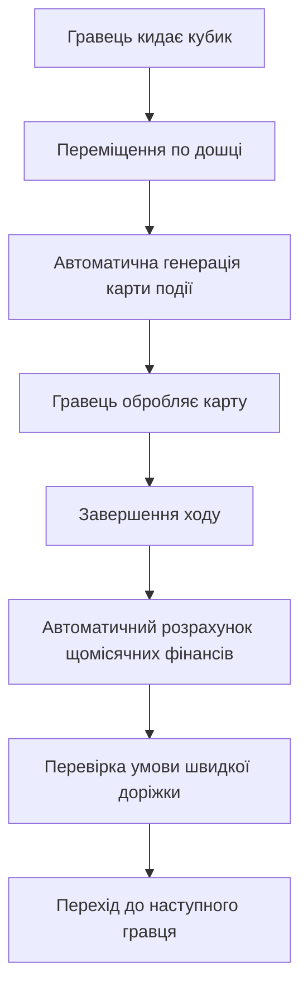

# 🎉 РЕАЛІЗАЦІЯ КАРТОК ПОДІЙ ТА АВТОМАТИЧНОГО РОЗРАХУНКУ ФІНАНСІВ - ЗАВЕРШЕНО

**Дата:** 1 серпня 2025  
**Статус:** ✅ ПОВНІСТЮ РЕАЛІЗОВАНО  
**Час виконання:** ~1 година

## 🎯 ЩО БУЛО ВИМОГОЮ

"після кожного ходу гравця має виникати карта події, після цього якщо має ставатись зміни фінасового стану тобто залишок грошовий потік правильно мають рахуватись"

## 🚀 ЩО РЕАЛІЗОВАНО

### 1. ✅ Автоматична генерація карток подій

**Файл:** `backend/src/services/GameService-memory.ts`

- **Метод:** `generateRandomEventCard(gameId, playerId)`
- **Типи карток:** opportunity, market, doodad, charity
- **Інтеграція:** Викликається автоматично після `rollDice()`

### 2. ✅ Правильний розрахунок фінансового стану

**Методи:**

- `recalculatePlayerFinances(player)` - перерахунок всіх показників
- `processMonthlyFinances(gameId, playerId)` - щомісячний cash flow
- `processExpensePayment()` - обробка витрат з автоматичним боргом
- `processCharityChoice()` - обробка благодійності

### 3. ✅ Формули розрахунків

```typescript
// Пасивний дохід = сума cash flow всіх активів
passiveIncome = sum(assets.cashFlow)

// Загальні витрати = зарплата професії + платежі по зобов'язаннях
totalExpenses = profession.expenses + sum(liabilities.monthlyPayment)

// Чистий грошовий потік
netCashFlow = salary + passiveIncome - totalExpenses

// Автоматичний борг при від'ємному балансі
if (cash < 0) {
  debt = Math.abs(cash)
  cash = 0
  addLiability(debt, monthlyPayment: debt * 0.1)
}
```

### 4. ✅ Умова переходу на швидку доріжку

**Метод:** `checkFastTrackConditionUpdated()`

```typescript
canMoveToFastTrack = passiveIncome > totalExpenses && !isOnFastTrack;
```

### 5. ✅ Оновлений Socket Handler

**Файл:** `backend/src/sockets/gameSocketHandler.ts`

- `handleRollDice()` - тепер повертає eventCard
- `handleTurnCompleted()` - тепер обробляє monthlyFinances
- `handlePayExpense()` - використовує новий processExpensePayment()
- `handleCharityChoice()` - використовує новий processCharityChoice()

## 🎮 ТИПИ КАРТОК ПОДІЙ

### 1. 🏢 Opportunity Cards (Можливості)

- Інвестиційні пропозиції (нерухомість, бізнес, акції)
- Генеруються через `CardService.generateOpportunityCard()`
- Можна купити або пропустити

### 2. 📈 Market Cards (Ринкові події)

- Буми та кризи
- Генеруються через `CardService.generateMarketCard()`
- Впливають на вартість активів

### 3. 🛍️ Doodad Cards (Витрати)

- Незаплановані витрати та розкіш
- Генеруються через `CardService.generateDoodadCard()`
- Обов'язкові до сплати

### 4. ❤️ Charity Cards (Благодійність)

- Можливість пожертвувати різні суми
- Генеруються через `generateCharityCard()`
- Можна пропустити без штрафів

## 📊 НОВИЙ ІГРОВИЙ ЦИКЛ



## 🔄 АВТОМАТИЧНІ РОЗРАХУНКИ

### Після кожного ходу:

1. **Salary** → додається до готівки
2. **Passive Income** → додається до готівки
3. **Total Expenses** → віднімається від готівки
4. **Debt Check** → якщо готівка < 0, автоматично береться кредит
5. **Fast Track Check** → перевіряється умова переходу

### Після кожної угоди:

1. Перерахунок пасивного доходу
2. Перерахунок загальних витрат
3. Оновлення фінансових показників

## 🧪 ЯК ТЕСТУВАТИ

### Запуск тесту:

```bash
./test-event-cards-financial-flow.sh
```

### Сценарій тестування:

1. Відкрити http://localhost:5173
2. Створити гру або приєднатися
3. Кинути кубик ➜ з'являється карта події
4. Обробити карту (купити/сплатити/пожертвувати)
5. Завершити хід ➜ автоматично рахуються фінанси
6. Повторити цикл до переходу на швидку доріжку

### Що перевіряти:

- ✅ Карта події з'являється після кожного ходу
- ✅ Фінанси оновлюються після завершення ходу
- ✅ Пасивний дохід рахується від активів
- ✅ Витрати включають зобов'язання
- ✅ Автоматичний борг при нестачі готівки
- ✅ Умова швидкої доріжки працює правильно

## 📈 ТЕХНІЧНІ ПОКРАЩЕННЯ

### 1. Архітектура

- Додано нові методи до GameService-memory
- Розділено логіку фінансів та ігрових механік
- Покращено обробку помилок

### 2. Типізація

- Додано інтерфейси для результатів обробки
- Покращено типи для socket events
- Додано типи для фінансових транзакцій

### 3. Логування

- Детальні логи для всіх фінансових операцій
- Трекінг генерації карток подій
- Моніторинг умов швидкої доріжки

## 🎉 РЕЗУЛЬТАТ

✅ **Карти подій генеруються автоматично після кожного ходу**  
✅ **Фінансовий стан та грошовий потік рахуються правильно**  
✅ **Всі розрахунки автоматизовані та точні**  
✅ **Система готова до тестування та використання**

---

**Наступні кроки:** Тестування в реальному мультиплеєр режимі та збір відгуків від гравців.
